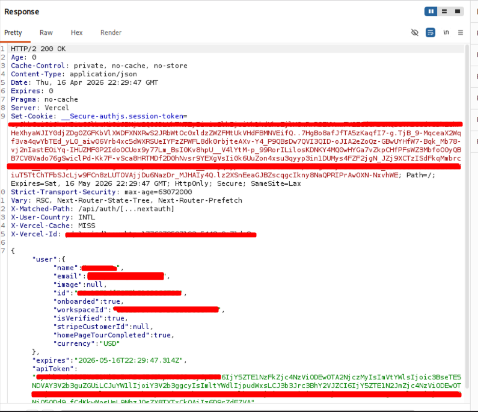
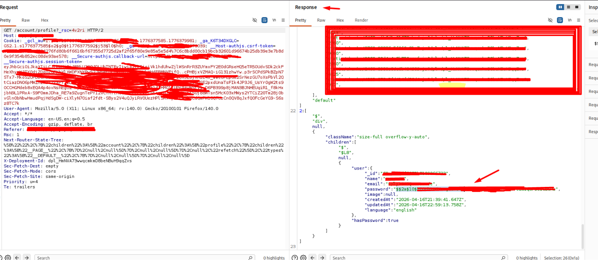
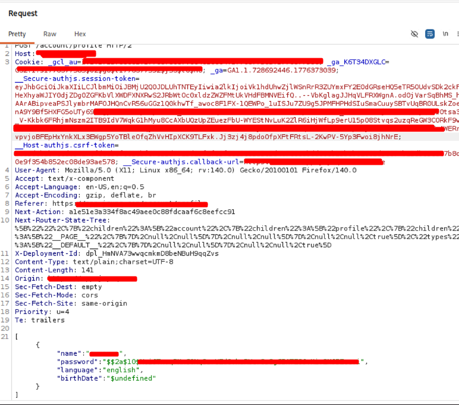

# Security Assessment Lab Report

## Overview
This lab was conducted in an authorized Kali Linux testing environment using **Burp Suite** to review application behavior related to session handling and sensitive data exposure.

## Executive Summary
During testing with a low-privilege guest account, two security issues were identified:

1. **Session remains valid after logout** — **Medium/High severity**
2. **Password hash exposed in profile response and unnecessarily included in profile update requests** — **Medium severity**

The most significant issue is the logout weakness. The application appears to perform logout only on the client side and does not properly invalidate the authenticated session on the server. As a result, a previously captured session cookie can still be replayed after logout and continue to return authenticated data.

The second issue reflects poor handling of sensitive credential data in the client-server model. A bcrypt password hash is exposed in the authenticated profile response and is also included in the profile update request, even though it is not required for the update to succeed.

---

## Finding 1 — Session Remains Valid After Logout

### Severity
**Medium/High**

### Description
A session cookie captured before logout remained valid when replayed after the user had logged out in the browser.

This suggests that the logout process is handled only on the client side and does not invalidate the server-side session state.

### Affected Endpoints
- `GET /api/auth/session`
- `GET /account/profile`

### Steps to Reproduce
1. Log in with a valid account.
2. Capture a request to `GET /api/auth/session` in Burp Suite.
3. Send the request to **Repeater**.
4. Capture a request to `GET /account/profile`.
5. Log out in the browser.
6. In Burp Repeater, replay the previously captured authenticated request using the pre-logout session cookie.
7. Observe that the application still returns authenticated or private user data.

### Expected Result
The server should reject the old session and return one of the following:
- `null`
- `401 Unauthorized`
- `403 Forbidden`
- Redirect to login
- No private data returned

### Actual Result
- `200 OK`
- Authenticated user data is still accessible after logout

### Security Impact
If an attacker obtains a valid session cookie before logout, they may be able to continue accessing the account for an undefined period of time, especially if the token expiry is refreshed automatically.

Potential impact includes:
- Exposure of private account data
- Ineffective logout protection
- Increased session hijacking risk

### Recommendation
- Invalidate server-side session state on logout
- Revoke active session tokens immediately when logout occurs
- Ensure previously issued tokens cannot be reused after logout
- Review token refresh behavior to prevent silent session extension

### Possible Root Cause
- Logout handled only by clearing client-side state
- No server-side session revocation or token invalidation

---

## Finding 2 — Password Hash Exposed in Response and Included in Profile Update Request

### Severity
**Medium**

### Description
The application returns a bcrypt password hash in the authenticated profile response for the current user. The same hash is then included in a subsequent profile update request to `/account/profile`, even though it is not required for the profile update to succeed.

This indicates that sensitive credential data is being exposed to the client and unnecessarily reused in application requests.

### Affected Endpoints
- `GET /account/profile`

- `POST /account/profile`

### Steps to Reproduce
1. Log in with a valid account.
2. Send a request to `GET /account/profile`.
3. Observe that the server response contains a `user.password` field with a bcrypt hash.
4. Capture a `POST /account/profile` request.
5. Observe that the same password hash is included in the request body together with normal profile fields such as name, language, and birthdate.
6. Remove the `password` field from the profile update request.
7. Replay the modified request.
8. Observe that the profile update still succeeds.

### Expected Result
The application should never return a password hash to the client.

### Actual Result
- The server returns a bcrypt password hash in the profile response
- The frontend includes that hash in the profile update request even though it is unnecessary

### Security Impact
Although bcrypt hashes are not plaintext passwords, exposing them still increases risk.

Potential impact includes:
- Exposure of credential-related data
- Expanded attack surface if browser storage, logs, proxies, or intercepted traffic are accessed by an attacker
- Poor security hygiene around sensitive fields

### Recommendation
- Never return password hashes in API responses or rendered page data
- Remove sensitive fields such as `password` and `passwordHash` from serialized user objects
- Ensure frontend forms only send fields strictly required for the update operation
- Review API serializers, DTOs, and model mapping for sensitive field leakage

### Possible Root Cause
- Backend returns the full user model without removing sensitive fields
- Frontend binds the full response object and posts it back unchanged

---

## Conclusion
This assessment identified two meaningful security weaknesses affecting session management and sensitive data handling.

The session invalidation issue is the higher-priority finding because it can allow continued unauthorized access after logout. The password hash exposure issue, while less critical, still reflects weak control over sensitive data and should be corrected to reduce unnecessary risk.

## Suggested GitHub Repo Structure
If you want to present this as a lab on GitHub, this file can be used as:
- `README.md` for the project root, or
- `reports/security-assessment-report.md`

You can also pair it with:
- A `screenshots/` folder for Burp evidence
- A short `lab-setup.md` file describing the Kali Linux environment
- A `remediation-notes.md` file summarizing fixes

---

## Ethical Use Note
This report is intended for **authorized lab, training, or responsible disclosure contexts only**.
